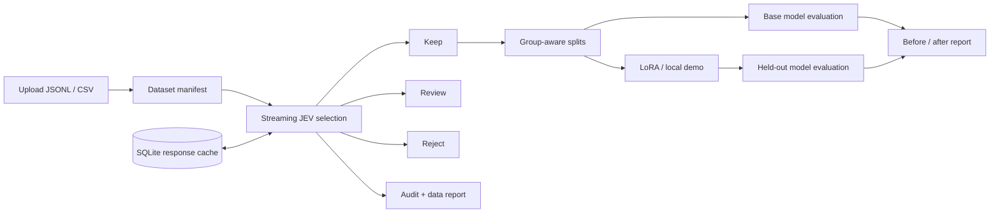

# JEV DataOps

**从数据筛选到模型评估，一个可追溯的开源工作台。**

Upload → Select → Evaluate data → Train → Evaluate model

JEV DataOps packages typed JEV judgments, streaming dataset processing and local model training into a single workbench. Upload JSONL/CSV, inspect keep/review/reject partitions, run automatic training, and compare the base and trained model on the same held-out data.

An independent community project. Not affiliated with or endorsed by TypeSafe or OpenRouter. MIT covers this project's code; API services and model weights have their own terms.

## 快速启动 / Quick start

Python 3.10+ on Linux or macOS:

```bash
git clone https://github.com/RenaGao/jev-dataops.git
cd jev-dataops
python3 -m venv .venv
source .venv/bin/activate
pip install -e '.[dev]'
jev-dataops serve
```

Open [localhost:8000](http://localhost:8000), choose **使用示例**, then start a workflow. The synthetic example contains 84 rows, including deliberate duplicates and review cases. No API key or GPU is required for the local demo.

**演示模式使用本地规则筛选和真实训练的字节二元模型，不调用 JEV，也不是大模型训练结果。** The UI and reports label this distinction. Metrics are computed from data, never populated with simulated improvements.

## 能力 / Features

- **Upload workbench:** drag-and-drop JSONL/CSV, bounded previews, durable dataset/run history, progress, cancellation, retry, artifact downloads.
- **Streaming selection:** bounded worker pool, SQLite deduplication/cache, per-record audit trail, versioned rubrics, confidence-aware keep/review/reject routing.
- **JEV integration:** TypeSafe direct or OpenRouter decisions API; structured answer validation, request-attempt budget, retries, server-side environment credentials.
- **Data evaluation:** retention/review/rejection counts, duplicate counts, dimension summaries and explicit error reports. These are diagnostics, not gold-label accuracy.
- **Automatic training:** retained data only; deterministic splits isolate both declared conversation groups and exact normalized content duplicates; at least six independent groups are required.
- **Model evaluation:** base versus trained model token-weighted NLL/perplexity on identical held-out splits; actual LoRA adapters with optional Hugging Face dependencies.
- **Reproducibility:** input SHA-256, configuration hash, audit JSONL, split assignments, model metadata and training/evaluation reports.

## 真实 JEV 筛选 / Live screening

Set a key on the **server**, then select the corresponding provider in the UI:

```bash
export OPENROUTER_API_KEY='your-key'
# Or: export TYPESAFE_API_KEY='your-key'
jev-dataops serve
```

Supported layouts:

```json
{"text":"A complete training passage.","group_id":"document-001"}
{"instruction":"Explain how to reset a password.","input":"","output":"Use the account recovery page.","group_id":"conversation-002"}
{"prompt":"Where are my settings?","response":"Open the profile menu.","group_id":"conversation-003"}
{"messages":[{"role":"user","content":"Hello"},{"role":"assistant","content":"How can I help?"}],"conversation_id":"conversation-004"}
```

Use one layout per record. `messages` takes precedence over `text`, then instruction/output, then prompt/response. CSV uses the same column names; a `messages` cell contains a JSON array. Files must be UTF-8; records are limited to 1 MiB, and default content length is 8–32,000 characters. The web upload limit defaults to 1 GiB.

Only normalized content fields are sent to the selected provider. Metadata stays local. **Content is not automatically anonymized:** redact or exclude sensitive content before selecting a live provider. Keys are not accepted from uploaded files and are never sent to the browser.

The default rubric checks content quality, apparent privacy exposure and training suitability. Finance/code rubrics are available through CLI/API. These model judgments need external calibration; model confidence is not an empirical accuracy guarantee. The OpenRouter decisions endpoint is alpha and can change. See the official [TypeSafe API](https://docs.typesafe.ai/api) and [OpenRouter decisions SDK](https://github.com/OpenRouterTeam/typescript-sdk/blob/main/src/funcs/alphaDecisionsCreate.ts).

## 大模型自动训练 / LLM training

On the training host:

```bash
pip install -e '.[train]'
export JEV_BASE_MODEL='HuggingFaceTB/SmolLM2-135M'
jev-dataops serve
```

Select **Hugging Face · LoRA** and enable automatic training. The default small model is for smoke runs; the operator can choose a compatible causal LM that fits available RAM/VRAM. The first run may download the configured model. Remote model code is disabled, and weights must use safetensors.

This release implements full-text causal SFT with LoRA. It is not an RLHF/DPO trainer, distributed training scheduler, or automatic model promotion service. The text screening flow does not evaluate audio quality. See [training and evaluation](docs/TRAINING.md) for split policy, metrics, truncation and device configuration.

## 批处理 / Batch CLI

```bash
jev-dataops run --input examples/dialogues.jsonl --output /tmp/jev-example

jev-dataops run --input /data/corpus.jsonl --output /data/run-001 \
  --provider openrouter --trainer huggingface --max-requests 100000 --concurrency 8

# Screening only:
jev-dataops run --input /data/corpus.csv --output /data/selection \
  --provider typesafe --trainer none --rubric general
```

The request budget counts actual HTTP attempts, including retries; it is not a dollar limit. Each retry invocation receives its configured attempt budget again. Incomplete screening blocks training. A failed web run can be retried from its saved cache; training restarts into a new attempt directory. CLI screening can reuse its output directory, while CLI training requires a fresh training output directory.

## Architecture



The first release is a **single-host workbench**: one server process, one queued workflow at a time, concurrent screening requests within that workflow. SQLite and streaming files keep dataset-sized indexes out of Python memory. This does not imply verified billion-row throughput. RAM must still fit a model replica. Upload size, disk space, API quota and worker concurrency remain practical limits. See [deployment](docs/DEPLOYMENT.md) and [scale checks](docs/BENCHMARKS.md).

## Docker

```bash
export JEV_API_TOKEN='choose-a-long-random-token'
docker compose up --build
```

Enter the token in the workbench's connection settings. The container image includes the web/demo runtime; use a GPU-specific image with `.[train]` for real LLM training. Uploads and results live in a named Docker volume.

## Development

```bash
pytest -q
python -m build
python scripts/benchmark.py --rows 100000 --output /tmp/jev-benchmark
```

Tests cover JEV response validation, bounded retries, streaming formats, deduplication/cache reuse, leakage-safe splits, real local training, API upload/auth/recovery and artifact access. Installing training extras also enables a real LoRA smoke test using a local tiny randomly initialized transformer; no model download is needed for that test.

See [CONTRIBUTING.md](CONTRIBUTING.md), [SECURITY.md](SECURITY.md), and [MIT license](LICENSE). Roadmap: external gold-label calibration, semantic deduplication, object storage/chunked uploads, distributed workers, task benchmarks, and explicit model promotion policies.
