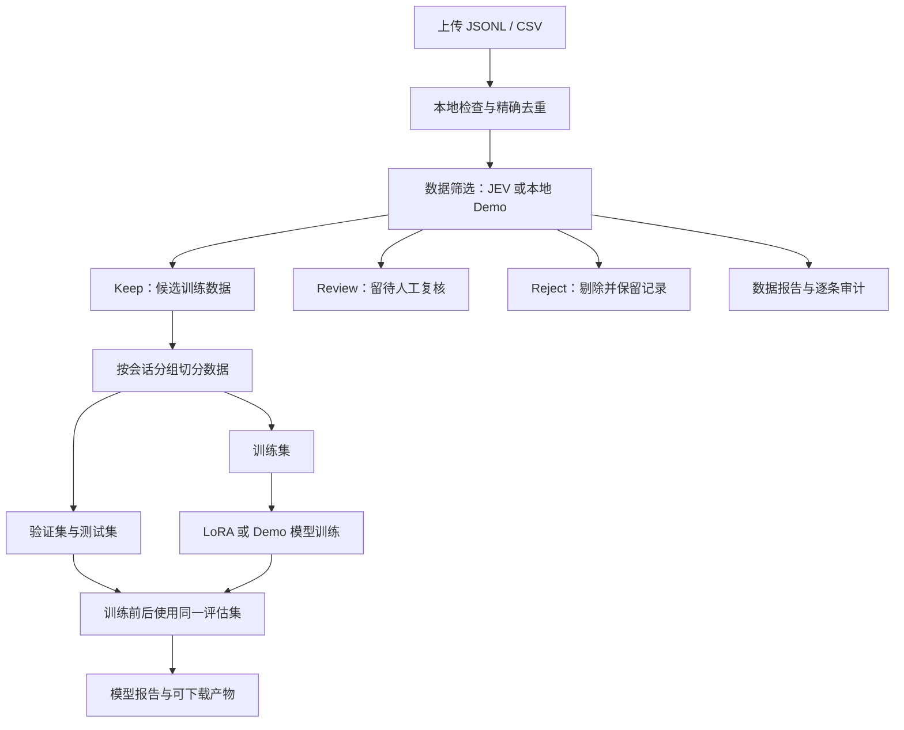

# JEV DataOps

**把「上传数据 → 筛选 → 数据评估 → 模型训练 → 训练后评估」串成一条可操作、可追溯的链路。**

你可以先在普通电脑上跑通示例，再接入 JEV 筛选服务和自己的大模型。项目同时提供浏览器工作台、命令行和 Python / HTTP API，适合需要反复验证“这批数据是否值得训练、训练后有没有变化”的开发者和研究者。

> **JEV 负责判断数据，目标模型负责学习数据。** 本项目调用 JEV API 做筛选；后续微调的是你配置的 Hugging Face 模型，不是 JEV 本身。

**第一次使用：** [跑通示例](#quickstart) → [准备自己的数据](#data) → [开启真实筛选](#jev) → [开启大模型训练](#training) → [读懂结果](#results)

**其他入口：** [命令行与 API](#automation) · [大数据处理](#scale) · [常见问题](#faq) · [部署与开发](#development)

English: A single-host workbench for streaming data selection, LoRA fine-tuning, and before/after evaluation on held-out data. Start with the offline demo, then configure a JEV provider and a target language model. See [training](docs/TRAINING.md) and [deployment](docs/DEPLOYMENT.md) for English technical documentation.

## 这条链路具体做什么？

| 步骤 | 系统做什么 | 你会得到什么 |
| --- | --- | --- |
| 1. 上传数据 | 读取 JSONL / CSV，记录文件信息并展示预览 | 可重复使用的数据集 |
| 2. 筛选数据 | 本地检查格式、长度和精确重复；真实模式再调用 JEV 判断质量 | `keep` 保留、`review` 待复核、`reject` 剔除三份数据 |
| 3. 评估数据 | 汇总分流数量、重复数、错误和 JEV 维度判断 | 数据报告与逐条审计记录 |
| 4. 训练模型 | 只使用保留数据，先按组切分，再训练配置的模型 | 训练日志、数据切分、模型产物 |
| 5. 评估模型 | 在相同的独立测试集上，对比训练前后的模型损失 | loss / perplexity 前后对比报告 |



**数据评估回答“筛进了什么数据”；模型评估回答“模型学完后发生了什么变化”。** 当前模型评估使用 loss 和 perplexity，不包含业务准确率、人工评分或模型自动上线。

<a id="quickstart"></a>
## 1. 先跑通本地示例

需要 **Linux 或 macOS、Python 3.10+、Git**。以下默认模式不需要 API Key、GPU 或下载大模型；首次安装依赖需要联网。

### 安装并启动

```bash
git clone https://github.com/RenaGao/jev-dataops.git
cd jev-dataops

python3 -m venv .venv
source .venv/bin/activate
pip install -e .

jev-dataops serve
```

保持终端运行，在浏览器打开 **[http://localhost:8000](http://localhost:8000)**。网页连接的是你启动的本机服务；GitHub 仓库首页不是在线训练网站。

### 在页面上完成第一次运行

1. 在「准备你的数据」中点击 **使用示例**，载入仓库自带的合成数据。
2. 保持「筛选引擎」为 **Demo · 本地规则验证**。
3. 保持「训练后端」为 **Demo · 流程验证**，开启 **筛选后自动训练与评估**。
4. 点击 **启动工作流**，在「运行与洞察」查看阶段、分流数量和日志。
5. 完成后查看 **独立测试集评估**，在 **产物与报告** 下载结果。

默认示例包含 84 行，预期得到 **80 条保留、2 条待复核、2 条剔除**；保留数据进一步分成 **56 条训练、12 条验证、12 条测试**。出现这些结果，说明上传、筛选、训练和评估链路已经跑通。

> Demo 筛选只做本地规则检查；Demo 训练会真实训练一个小型字节二元统计模型。它用于验证整个流程，**不代表 JEV 的判断能力，也不代表大模型训练效果**。

<a id="data"></a>
## 2. 换成你自己的数据

将文件拖入上传区域，或点击选择文件。上传后先检查预览，再选择筛选与训练方式。

### 推荐：JSONL，每行一个 JSON 对象

指令微调数据可以写成：

```jsonl
{"id":"sample-001","group_id":"conversation-001","instruction":"如何修改通知偏好？","input":"","output":"打开设置页面，选择通知，再按需调整提醒。"}
{"id":"sample-002","group_id":"conversation-002","instruction":"忘记密码怎么办？","input":"","output":"在登录页面选择找回密码，并按提示完成身份验证。"}
```

上面两行仅用于说明格式。开启自动训练时，**筛选后至少需要 6 个独立分组**；准备更多样本，才能留出有意义的训练、验证和测试数据。

系统支持以下四种内容结构，**每条记录选择一种即可**：

| 数据类型 | 必需的内容字段 | 适用场景 |
| --- | --- | --- |
| 纯文本 | `text` | 文章、段落、领域文本 |
| 指令与答案 | `instruction`、`output`；`input` 可选 | 指令微调数据 |
| 问答对 | `prompt`、`response` | 单轮问答 |
| 多轮对话 | `messages`，每项包含字符串 `role` 和 `content` | 对话训练数据 |

多轮对话示例：

```jsonl
{"conversation_id":"chat-001","messages":[{"role":"user","content":"文件上传失败怎么办？"},{"role":"assistant","content":"请先检查文件格式和网络连接，然后重试。"}]}
```

`role` 支持 `system`、`user`、`assistant`、`tool`，当前只接收文本内容。若一条记录混用多种结构，系统依次优先选择 `messages`、`text`、指令与答案、问答对；不要依赖混用字段来拼接训练内容。

### 也可以上传 CSV

第一行是字段名，后续每行是一条记录。例如：

```csv
instruction,output,group_id
如何修改通知偏好？,在设置中打开通知页面并保存新偏好。,conversation-001
忘记密码怎么办？,在登录页面选择找回密码并完成验证。,conversation-002
```

字段中有英文逗号、双引号或换行时，使用标准 CSV 转义。`messages` 列需要存放 JSON 数组字符串。直接上传 `.xlsx` 暂不支持，请先导出为 UTF-8 CSV。

### 为什么要填写分组 ID？

同一会话、文档或其他不能拆开的数据单元，应使用相同的 `group_id` 或 `conversation_id`。系统将关联记录放进同一个数据分区，减少“训练时看过测试内容”的问题。相同的归一化文本也会关联到同组；未提供分组 ID 时，主要依靠内容哈希分组。

默认按独立分组分配约 **70% 训练 / 15% 验证 / 15% 测试**。各组行数不同时，最终行数比例会不同。精确重复检查不识别改写或语义相似样本。

**输入限制：** 文件使用 UTF-8；网页上传默认上限 1 GiB；单条记录不超过 1 MiB；默认内容长度范围为 8–32,000 个字符。额外的 `id`、来源、分组等字段会保留在本地分流文件中。

<a id="jev"></a>
## 3. 开启真实 JEV 数据筛选

先在运行服务的终端中配置以下一种服务的 Key。若服务已经启动，先停止，再在设置好环境变量的终端重新启动。

**通过 OpenRouter：**

```bash
export OPENROUTER_API_KEY='替换为你的 OpenRouter Key'
jev-dataops serve
```

**或者直连 TypeSafe：**

```bash
export TYPESAFE_API_KEY='替换为你的 TypeSafe Key'
jev-dataops serve
```

两家平台的 Key 不能互换。在网页中刷新后，将「筛选引擎」切换为 **JEV · OpenRouter** 或 **JEV · TypeSafe**。

第一次使用真实 API，可以先上传一份小样本，**关闭「筛选后自动训练与评估」**，只看筛选结果。这样能先核对判断和复核量，再决定是否训练。

### 筛选结果如何决定？

默认通用规则评估内容质量、明显的隐私暴露和训练适用性。格式错误、长度异常和精确重复会先在本地处理；JEV 判断按以下规则分流：

| 结果 | 含义 | 后续处理 |
| --- | --- | --- |
| **Keep** | 各维度均达到当前规则的保留条件与置信度门槛 | 完整筛选结束后，可进入训练候选集 |
| **Review** | 判断不确定、置信度不足，或记录 / 响应需要核查 | 写入复核文件，不自动进入训练 |
| **Reject** | 至少一个维度明确不通过，或命中本地剔除规则 | 写入剔除文件，保留原因 |

分流优先级为 **Reject → Review → Keep**：若一个维度需要复核，但另一个维度已明确不通过，最终仍会剔除。

原始上传文件不会被删除。当前 `review.jsonl` 供下载后人工检查，网页尚未提供逐条标注与自动回流功能。修正后可作为新数据集上传。

| 页面参数 | 默认值 | 如何理解 |
| --- | --- | --- |
| 质量置信度阈值 | `0.85` | 判断的最低置信度门槛，不表示“85% 的样本一定正确”；Demo 不使用此门槛 |
| 并发请求数 | `4` | 同时处理的筛选任务数；真实吞吐受服务配额影响 |
| 请求上限 | `1000` | 本次运行最多发送的 HTTP 请求次数，包含重试；不是样本数，也不是金额上限 |

如果请求预算耗尽、认证失败或网络故障导致筛选不完整，系统会阻止后续自动训练。可用的领域规则包括 `general`、`finance`、`code`，通过 [CLI 或 API](#automation) 选择；当前网页使用 `general`。

> **真实筛选会把选中的内容字段发送到所选第三方服务。** 请先自行脱敏并确认有权传输。模型的隐私检查发生在提交之后，不能代替上传前脱敏。网页「连接设置」里的访问令牌是 `JEV_API_TOKEN`，用于访问工作台，不是 OpenRouter / TypeSafe Key。Python CLI 不会自动读取 `.env` 文件。

接口依据：[TypeSafe API](https://docs.typesafe.ai/api)、[OpenRouter decisions SDK](https://github.com/OpenRouterTeam/typescript-sdk/blob/main/src/funcs/alphaDecisionsCreate.ts)。OpenRouter decisions 接口目前为 alpha，接口或模型可用性可能变化。

<a id="training"></a>
## 4. 开启真实大模型训练

筛选引擎和训练后端是两个独立选项。**切换到真实 JEV，并不会自动把训练后端改成大模型。**

| 你想做什么 | 筛选引擎 | 训练后端 / 开关 |
| --- | --- | --- |
| 不花 API 费用，先验证完整流程 | Demo | Demo，开启自动训练 |
| 只筛选和检查数据 | JEV · OpenRouter 或 TypeSafe | 关闭自动训练 |
| JEV 筛选后微调大模型 | JEV · OpenRouter 或 TypeSafe | Hugging Face · LoRA，开启自动训练 |
| 本地规则筛选后微调大模型 | Demo | Hugging Face · LoRA，开启自动训练 |

### 安装依赖并指定目标模型

在相同项目目录、相同虚拟环境中执行：

```bash
pip install -e '.[train]'
export JEV_BASE_MODEL='HuggingFaceTB/SmolLM2-135M'
jev-dataops serve
```

若使用真实 JEV，请同时保留上一节设置的服务 Key。服务已运行时需要重启，才能读取新的环境配置。

刷新网页，选择 **Hugging Face · LoRA**，开启 **筛选后自动训练与评估**，然后启动工作流。训练和评估在**运行后端服务的机器**上执行，不在浏览器里执行。

默认小模型用于验证运行路径。你可以通过 `JEV_BASE_MODEL` 指定兼容的 Hugging Face 模型或本地模型目录。首次运行可能下载模型；算力和内存需求取决于模型。设备默认优先使用 CUDA，否则使用 CPU；可通过 `JEV_TRAIN_DEVICE` 指定设备。模型须支持标准 causal LM 加载、具备 EOS token，使用 safetensors 权重，且不依赖远程自定义 Python 代码。

### 训练时实际发生什么？

1. 完整筛选结束后，读取 `keep.jsonl`，其余两类数据不参与训练。
2. 按分组切分训练、验证、测试集；独立分组不足时停止。
3. 测量基础模型在验证集和测试集上的 loss。
4. 在训练集上进行 LoRA 微调。
5. 使用相同的验证集和测试集再次评估，并保存适配器和报告。

**默认参数是小规模验证配置：1 个 epoch、最多 20 个训练 step、batch size 4、序列长度 256。** 序列长度在大模型模式下按 token 计，Demo 按 UTF-8 字节计。到达 epoch 或 step 上限就会停止，长样本会截断；不能据此认定整份大数据集已训练完成。实际训练步数、样本访问数和 loss 会写进 `training_report.json`。

正式实验应通过 [HTTP API 或 Python API](#automation) 调整参数。当前网页和 CLI 没有训练步数输入项。训练方式为全文 causal SFT：prompt 和 response 都参与 loss；尚未实现仅答案位置计算 loss、DPO / RLHF、分布式训练或自动模型发布。

产出的 `model/` 是 **LoRA 适配器及 tokenizer 文件**，使用时仍需原始基础模型。更多配置与限制见 [训练说明](docs/TRAINING.md)。

<a id="results"></a>
## 5. 运行完成后，先看什么？

### 先检查数据，再解释模型指标

1. **看分流数量：** 保留多少、复核多少、剔除多少。保留率高只说明更多数据通过当前规则，不等于准确率高。
2. **抽查具体记录：** 下载三份分流数据，结合 `audit.jsonl` 查看记录的分流原因；真实 JEV 模式还会记录判断维度和模型标识。
3. **看训练是否符合预期：** 核对训练 / 验证 / 测试数量、实际步数、使用的模型和截断长度。
4. **对比测试集指标：** 确认比较的是同一组数据、同一种指标，再判断是否继续扩大实验。

| 指标 | 含义 | 怎么读 |
| --- | --- | --- |
| `baseline_loss` | 训练前模型在测试集上按预测 token 数加权的平均负对数似然 | 基线 |
| `trained_loss` | 训练后模型在同一测试集上按预测 token 数加权的平均负对数似然 | 与基线比较，通常越低越好 |
| `delta_loss` | `trained_loss - baseline_loss` | 负数表示 loss 下降；正数表示上升 |
| `baseline_perplexity` / `trained_perplexity` | 对应模型的困惑度 | 同一评估口径下比较，通常越低越好 |
| `split_counts` | 训练、验证、测试集行数 | 检查数据是否成功保留和切分 |

例如，loss 从 `2.50` 变成 `2.30`，则 `delta_loss = -0.20`。这是指标解释示例，不是项目承诺的训练收益。

Demo 的指标按 UTF-8 字节计算，大模型模式按 tokenizer token 计算，**两者不能直接比较**。测试集 loss 下降也不等于业务准确率、事实性或用户体验提升；这些需要额外的任务评测和人工验证。反复根据测试集结果调参会削弱它的独立性，正式决策应另留外部评测集。

### 文件放在哪里？

网页默认将数据保存在启动命令所在目录的 `.jev-dataops/`（按快速启动操作时即项目目录），可用 `jev-dataops serve --data-dir /your/data/path` 更换位置。每个任务都有自己的目录：

```text
.jev-dataops/
├── datasets/                     # 原始上传文件
├── metadata.sqlite3              # 数据集与运行记录
└── runs/<run_id>/
    ├── screening/
    │   ├── keep.jsonl            # 候选训练数据
    │   ├── review.jsonl          # 待人工复核
    │   ├── reject.jsonl          # 已剔除数据
    │   ├── audit.jsonl           # 逐条判断与原因
    │   ├── data_report.json      # 数据统计与完成状态
    │   └── cache.sqlite3         # 筛选结果缓存
    └── training-1/               # 第一次训练尝试
        ├── train.jsonl
        ├── validation.jsonl
        ├── test.jsonl
        ├── training_report.json # 参数、步数、loss 记录
        ├── model_report.json    # 训练前后评估
        └── model/               # 模型产物
```

网页「产物与报告」可以下载分流数据、报告和模型文件。未训练的任务不会有训练产物；失败任务可能只有部分文件，应以运行状态和报告的完成标记为准。默认运行目录已加入 Git 忽略规则。

<a id="automation"></a>
## 6. 用 CLI 或 API 接入已有流程

### 命令行：不打开网页也能跑

```bash
# 本地 Demo 全链路；首次运行使用一个新的输出目录
jev-dataops run --input examples/dialogues.jsonl --output /tmp/jev-demo-001

# 仅做真实 JEV 筛选；先设置 TYPESAFE_API_KEY
jev-dataops run --input /data/corpus.csv --output /data/selection-001 \
  --provider typesafe --trainer none --rubric general \
  --concurrency 4 --max-requests 1000

# 真实筛选 + LoRA 训练；先设置 OPENROUTER_API_KEY 和 JEV_BASE_MODEL，并安装训练依赖
jev-dataops run --input /data/corpus.jsonl --output /data/llm-run-001 \
  --provider openrouter --trainer huggingface --rubric general \
  --confidence 0.85 --concurrency 4 --max-requests 1000
```

将路径替换为自己的文件与输出目录。真实请求上限应根据样本量和预算设置，1000 次不保证足以完成 1000 条样本的筛选，因为重试也计数。CLI 输出位于指定目录的 `screening/` 和 `training/`，与网页的 `training-1/` 命名不同。

`jev-dataops run --help` 可查看支持的参数。CLI 的训练使用上述默认小规模配置；它当前不接收 `--max-steps` 或 `--epochs` 参数。

### HTTP API：配置更完整的训练实验

启动服务后，先上传文件，记录返回的 `id`：

```bash
curl -F 'file=@my-data.jsonl' http://localhost:8000/api/datasets
```

将下面的 `dataset_id` 替换为该 ID，再创建任务。此示例会使用真实 JEV API 并启动实际 LoRA 训练，需先完成前面的环境配置：

```bash
curl http://localhost:8000/api/runs \
  -H 'Content-Type: application/json' \
  -d '{
    "dataset_id": "替换为上传返回的id",
    "provider": "openrouter",
    "trainer": "huggingface",
    "auto_train": true,
    "rubric": "general",
    "confidence": 0.85,
    "concurrency": 4,
    "max_requests": 1000,
    "epochs": 1,
    "max_steps": 100,
    "learning_rate": 0.0002,
    "max_seq_length": 512,
    "seed": 42
  }'
```

这些参数只是格式示例，训练规模需按数据与算力调整。创建后用 `GET /api/runs/<run_id>` 查看状态，或回到网页查看。同一服务开启 `JEV_API_TOKEN` 时，每个 API 请求还需添加 `-H "Authorization: Bearer $JEV_API_TOKEN"`。

完整接口在运行中的 [Swagger 文档](http://localhost:8000/docs)；若要单独调用训练模块、调整 batch size 或切分比例，见 [Python API 示例](docs/TRAINING.md#python-api)。

<a id="scale"></a>
## 7. 数据量增大后怎么使用？

项目使用流式读取、有限并发，以及 SQLite 磁盘去重和缓存，避免把整个数据集放进 Python 内存。**当前是单机工作台**：一次执行一个完整任务，任务内部并发筛选；尚未提供分布式队列、对象存储或断点分片上传。模型本身仍需装入内存 / 显存。

已有一次可复现的本地测试：**10 万条合成记录，筛选约 93 秒，峰值进程内存约 50 MiB**。它测试的是本地规则与磁盘管道，不是 JEV API 吞吐或大模型训练速度。测试环境、训练步数和复现命令见 [基准说明](docs/BENCHMARKS.md)。

扩大数据量时，先用小样本核对 schema、筛选规则和分组，再增加请求预算与并发，最后扩大训练步数。根据 `review` 和 `reject` 的抽查结果调整数据，不要只追求保留率。磁盘需容纳原文件、分流文件、审计缓存、训练切分和模型产物。

<a id="faq"></a>
## 8. 常见问题

| 现象 | 原因与处理 |
| --- | --- |
| JEV 选项显示「未配置」 | 在后端进程中设置对应服务 Key，重启服务并刷新网页；不要把 Key 填进网页访问令牌输入框 |
| Hugging Face 显示「未安装」 | 在启动服务的同一 Python 环境中安装 `.[train]`，然后重启 |
| 上传 `.json` / `.xlsx` 失败 | 网页接受 `.jsonl` / `.csv`；JSONL 是一行一个对象，不是整个 JSON 数组 |
| 提示独立分组不足 | 保留数据至少要有 6 个独立组件；相同会话或重复内容可能把多行合并为一组，不应为绕过限制随意改 ID |
| 任务失败或请求预算耗尽 | 查看错误与数据报告。失败 / 取消的网页任务可点「重新运行」复用筛选缓存；它使用原配置，且每次重新获得配置的请求预算 |
| 想换阈值、预算或训练方式 | 修改配置后创建新任务；网页的「重新运行」不会修改原任务配置，缓存也不是所有新任务全局共享的 |
| 重新运行是不是接着上次训练？ | 筛选可复用成功缓存；训练会写入新的 `training-2/` 等目录，从头训练，不恢复优化器状态 |
| CLI 再跑一次提示训练产物已存在 | CLI 可复用筛选目录，但训练不会覆盖现有产物。需要保留旧结果并给新训练使用空目录；更方便的重试入口是网页 |
| 训练很快结束，或只训练了几十条数据 | 检查 `max_steps`、epoch 与实际样本访问数；默认最多 20 步是为了验证链路 |
| 大模型下载失败、显存不足 | 核查模型访问权限和设备资源；选择能装入设备的兼容模型，或用 `JEV_BASE_MODEL` 指向已准备好的本地模型目录 |
| loss 没有下降 | 这可能是实际结果。检查数据、切分和训练参数，再做任务评估；系统不保证每次微调都有收益 |
| 服务重启后任务显示失败 | 未完成任务会被标记为中断；可重新运行并复用筛选缓存，不会冒充完成 |

<a id="development"></a>
## 9. 部署、开发与项目边界

### Docker 启动

```bash
export JEV_API_TOKEN='替换为你生成的长随机访问令牌'
docker compose up --build
```

打开 [http://localhost:8000](http://localhost:8000)，在「连接设置」输入同一令牌。默认 Docker 镜像包含网页与 Demo 运行环境；真实 LLM 训练需另配置训练依赖和合适的设备环境。团队远程使用时，还需要 HTTPS、访问控制和独立的数据存储规划，见 [部署说明](docs/DEPLOYMENT.md)。

### 本地开发验证

```bash
pip install -e '.[dev]'
pytest -q
python -m build
```

安装 `.[train]` 后，测试还会执行使用本地微型 Transformer 的真实 LoRA 训练检查。该测试不下载模型，不证明某个预训练模型的业务效果。

| 已提供 | 尚未提供 |
| --- | --- |
| JSONL / CSV 上传与流式筛选 | Excel 原生解析、音频质量评估 |
| JEV 三分流、逐条审计、缓存重试 | 人工标注台、语义去重、人工金标准确率校准 |
| 分组切分、LoRA SFT、训练前后 loss 评估 | DPO / RLHF、多机训练、业务基准评测、自动上线 |
| 本地工作台与共享访问令牌 | 多租户隔离、完整 SaaS 用户系统 |

**许可证与贡献：** 项目源码采用 [MIT](LICENSE)，模型权重与第三方 API 分别遵循各自条款。本项目是独立社区项目，与 TypeSafe / OpenRouter 无隶属或官方背书关系。欢迎通过 [贡献指南](CONTRIBUTING.md) 提交改进；安全问题见 [SECURITY.md](SECURITY.md)。
